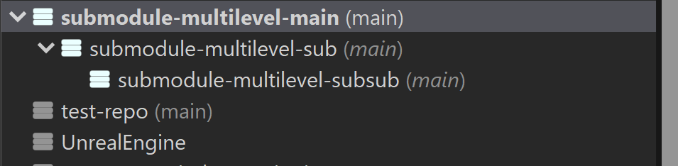

# testimonial

If they were to swallow their 'I am a command line only nerd' pride and use SmartGit then I think they could see how good submodules can be... They are actually sharing a submodule and they don't even know it.

# summary

In a unique case of cross-disciplinary collaboration, SmartGit has successfully bridged the gap between sound engineers and game developers through its intuitive handling of Git submodules, making version control accessible to team members regardless of their technical expertise.

# challenge

- Managing complex Git submodules across diverse teams
- Enabling collaboration between technical and non-technical team members
- Making Git workflows accessible to team members without command-line experience  
- Maintaining efficient version control for audio assets in game development
- Coordinating work between sound engineers unfamiliar with Git and experienced developers

# solution

- Intuitive graphical interface for submodule management
- Simplified workflows for basic Git operations
- Visual representation of complex Git concepts
- User-friendly approach to repository management
- Seamless submodule integration without technical overhead

# gallery

# impact

- Enabled successful collaboration between sound engineers and game developers
- Eliminated the need for extensive Git training for non-technical team members
- Streamlined asset management through submodules
- Reduced technical barriers in cross-team collaboration
- Maintained project organization without compromising on Git's powerful features

# benefits

- Accessible to both beginners and advanced users
- Intuitive submodule management  
- Reduced learning curve for new team members
- Improved workflow efficiency
- Enhanced cross-team collaboration

# features

- Integrated display of submodule files in the working tree (Working Tree window)
- Advanced submodule management capabilities

# conclusion

SmartGit has proven that complex Git features like submodules can be made accessible without sacrificing functionality. By providing an intuitive interface that caters to both beginners and experts, SmartGit has enabled effective collaboration between technical and non-technical team members in game development projects. The software's approach to submodule management has transformed what many consider a challenging Git feature into a practical tool for cross-team collaboration.