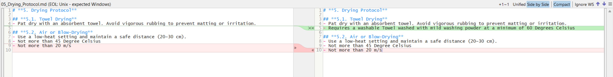
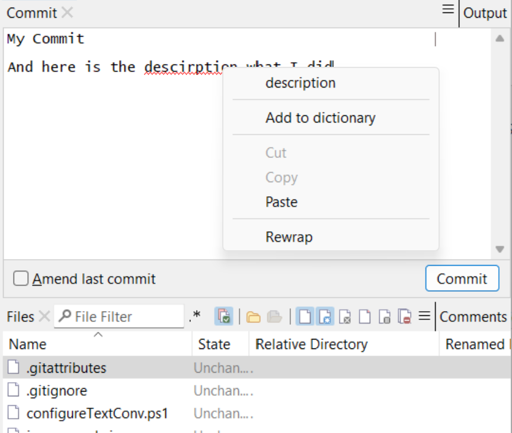
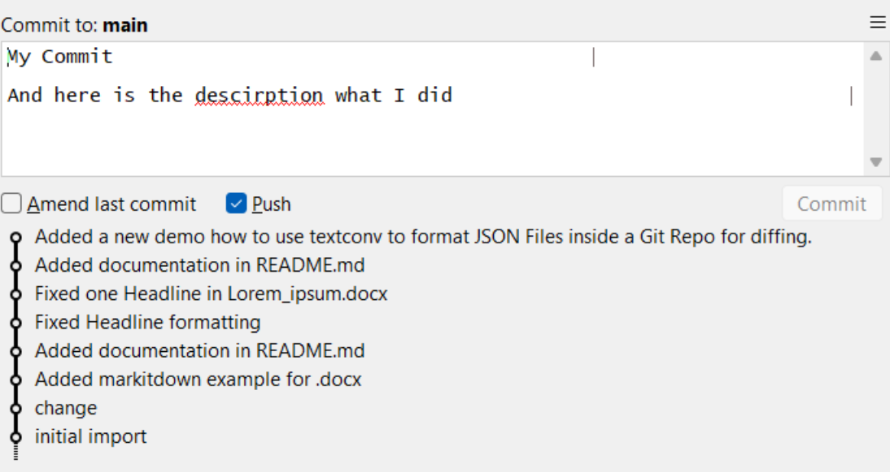

# testimonial

SmartGit is amazing... What I most love about it is that it clearly separates the single commit preparation (one window) from the tree management (a separate window). This highly helps me to focus on the current task.

# summary

A professional developer's experience highlights how SmartGit's thoughtful interface design and attention to detail enhances workflow efficiency. The software's intelligent organization of information and tasks helps developers maintain focus while managing complex version control operations.

# challenge

- Managing multiple aspects of version control simultaneously
- Maintaining focus during different Git operations
- Accessing appropriate level of detail for different tasks
- Navigating between working tree and repository history
- Efficient handling of file comparisons

# solution

- Separate windows for commit preparation and repository history (Log)
- Intelligent side-by-side diff display for file comparisons
- Strategic information organization and presentation
- Comprehensive keyboard shortcuts
- Context-aware information display
# gallery

# impact

- Enhanced focus during development tasks
- Improved efficiency in commit preparation
- Streamlined commit management
- Reduced context switching overhead
- More effective file comparison workflows

# benefits

- Clear separation of concerns in the interface
- Intuitive information presentation
- Rich keyboard shortcut support
- Optimized file comparison views
- Enhanced task focus

# features

- Separate Working Tree and Log Window
- Side-by-side diff display for file comparisons
- Dedicated commit preparation area
- Extensive keyboard shortcuts

# conclusion

SmartGit's thoughtful interface design demonstrates how careful attention to user workflow can significantly enhance productivity. By separating different aspects of version control into distinct, focused interfaces and providing the right level of detail at the right time, SmartGit enables developers to maintain better focus and work more efficiently. The combination of intelligent information display and rich feature set makes it a standout tool for professional development workflows.
