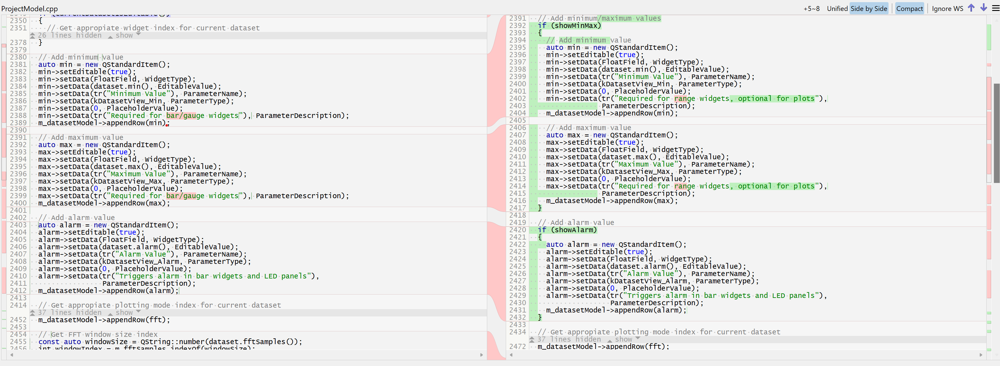
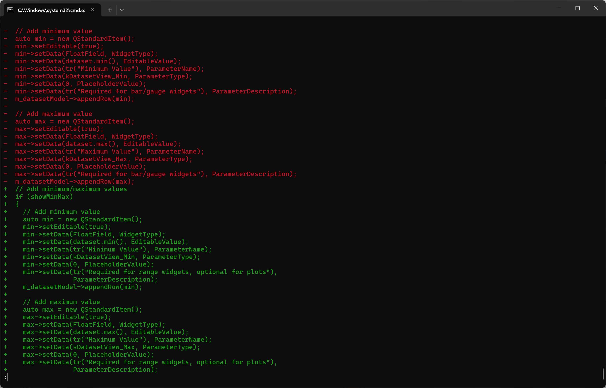

# testimonial

I've been tweaking some C++ classes, and I always carefully review each batch of edits in the SmartGit Changes view ... With my changes scattered all over this 1,700-line file, I can't imagine a better way to make sure my changes are consistent and complete.

# summary

When dealing with extensive codebases, precision matters. Just ask one of our long-time users, a C++ developer who regularly works with files exceeding 1,700 lines of code. What could have been a challenging and error-prone review process has been transformed into a streamlined, confident workflow thanks to SmartGit.

# challenge

- Managing scattered changes across large C++ class files
- Ensuring consistency across multiple code modifications
- Maintaining accuracy during complex code reviews
- Navigating through thousands of lines of code efficiently

# solution

Using SmartGit's Changes view, the developer can:

- Instantly visualize all modifications in context
- Review changes systematically, regardless of their location in the file
- Track every edit with precision

This is supported by quickly navigating the Files view and/or opening separate Compare windows, on demand

# gallery

# impact

- Reduced review time by providing clear, contextual visibility of changes
- Minimized the risk of overlooking critical code changes through inline change display
- Improved code quality through comprehensive review capabilities
- Enhanced developer confidence in code modifications

# benefits

- Enhanced visibility of code changes
- Improved accuracy in code reviews
- Increased confidence in code modifications
- Streamlined review process for large files

# features

- Changes View
- Files View
- Compare windows

# conclusion

This real-world example demonstrates how SmartGit's intuitive Changes view transforms complex code review challenges into manageable, efficient processes, helping developers maintain high standards of code quality even when working with extensive codebases.

# internal notes (not rendered to HTML)

Screenshot:
https://github.com/Serial-Studio/Serial-Studio.git
Commit: 5bb10b85a0b4090e04bb005b3eea549d38740098