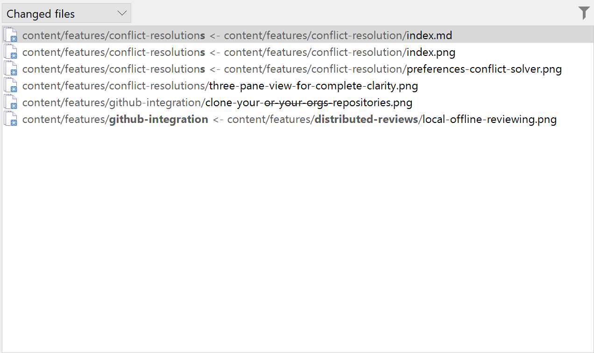

# 証言

SmartGit により、ついにリファクタリングが意味のあるものになりました。調整に時間を費やすことなく、何が変更されたのかを正確に確認できます。

# まとめ

他の人が行ったリファクタリングをレビューするときは、明確さが重要です。 10 近くの異なる Git UI をテストした後、Magnus は最終的に、複雑なファイルの名前変更と移動を即座に理解できるようにする SmartGit を見つけました。変更を視覚化するその直感的な方法は、彼のレビュー プロセスを変革し、本当に重要なこと、つまりコードの品質に集中し続けるのに役立ちました。

# チャレンジ

- 10 近くの異なる Git UI を試しましたが、名前変更を明確に表示するものが見つかりませんでした
- ファイルがどのパスから移動され、どこに移動したかを確認するのに苦労しました
- リファクタリングのレビューに時間がかかりすぎ、変更を頭の中でつなぎ合わせる必要があった
- 大規模なコミット後にプロジェクト構造を理解するための信頼できる視覚的な方法が必要でした

# 解決

- SmartGit の名前変更検出により、ファイルの移動が明確かつコンテキストとともに即座に明らかになりました
- 名前を変更したファイルの起点と宛先を視覚的に接続したコミット ビュー
- 生の差分を調べることなく、リファクタリングに関する瞬時の洞察を提供
- コードレビューと日常のGit操作のためのスムーズで統合されたエクスペリエンスを提供

# ギャラリー

# インパクト

- 時間がかかり、断片化したコードレビューをスムーズで視覚的なセッションに変えました。
- 大規模なコミットでも、名前が変更されたモジュールを一目で見つけることができます
- 他の人の作業をレビューする際のコラボレーション効率の向上
- より効果的な監視を通じてよりクリーンなコードベースの維持を支援
- 開発プロセスにおける信頼の強化

# 利点

- 名前変更または移動されたファイルを即座に確認できる
- 大規模なリファクタリングのためのコードレビューの高速化
- 認知負荷の軽減 -- 推測が減り、理解が深まります
- 他の人が加えた変更をレビューする際に自信が持てる
- 追加のツールや差分スクリプトを必要としない、シームレスなワークフロー統合

# 特徴

- 移動およびリファクタリングされたファイルを正確に識別する高度な名前変更検出
- 名前を変更したファイルの元のパスと宛先のパスを視覚的に表現
- 生データの代わりに構造とコンテキストを提供する直感的なコミット ビュー
- コマンドラインのオーバーヘッドなしで複雑な Git 操作をサポート
- 毎日の使用に適した、一貫したプロフェッショナルな UI

# 結論

SmartGit は、リファクタリング レビューを、退屈でエラーが発生しやすいものから、明確で効率的で信頼性の高いものに変換します。これは、クラス最高の Git クライアントとして、また使いやすさと実用的な洞察を優先してオープンソース開発者を一貫してサポートするツールとして際立っています。その結果、レビューが迅速化され、信頼性が高まり、チーム間のコラボレーションが強化されます。
