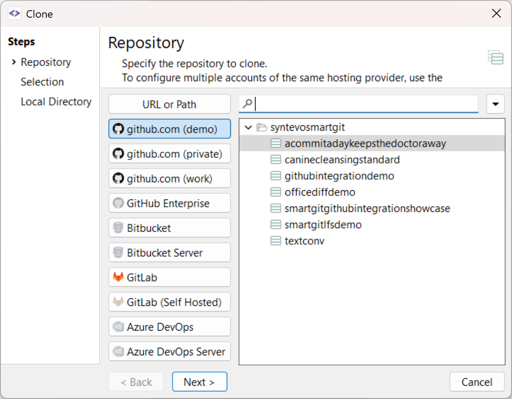
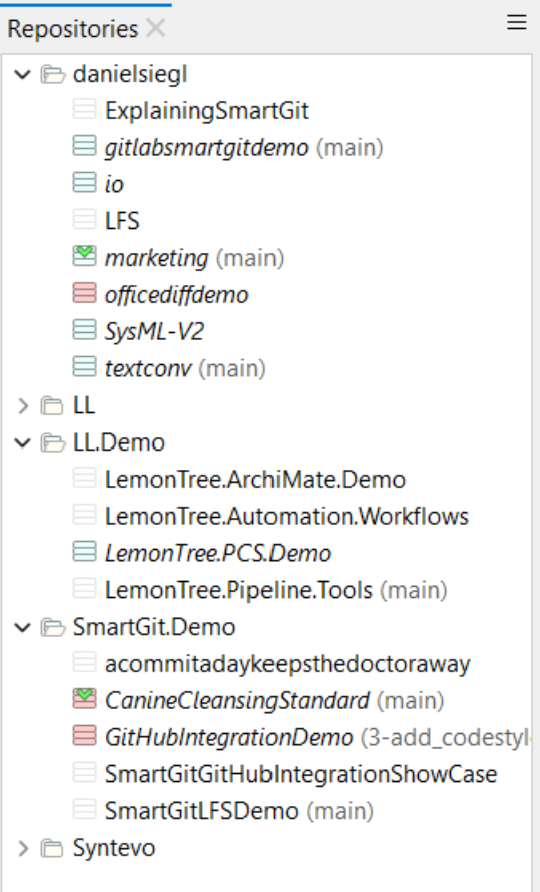
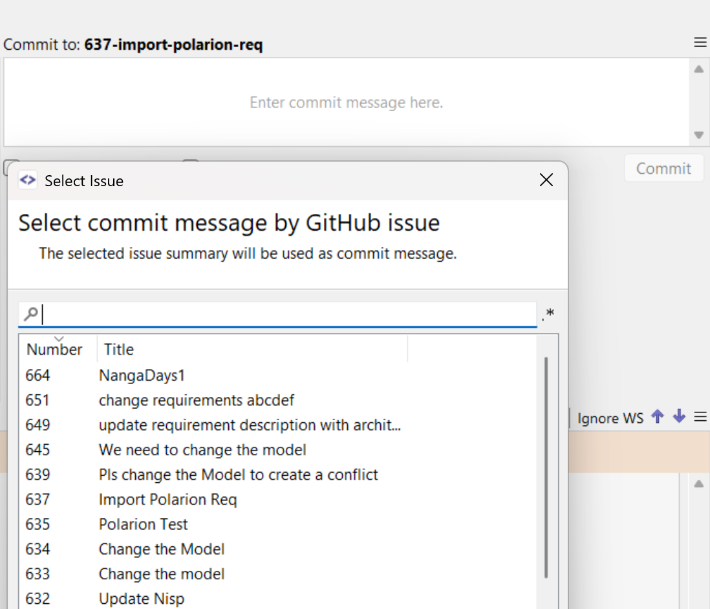

# 証言

コマンド ライン インターフェイスで実行できるほとんどすべての Git 操作を、SmartGit で実行できます。何年も使った後でも、今まで見たことのない機能を発見することがあります。

# まとめ

開発者の複数のプロジェクト タイプにわたる SmartGit の包括的な経験は、専門的な作業から個人およびオープンソース プロジェクトに至るまで、多様なリポジトリ ニーズに対応するこのツールの多用途性を実証しています。カスタマイズ可能なインターフェイス、コマンドライン機能の同等性、応答性の高いサポートの組み合わせにより、さまざまなサイズの約 30 のリポジトリを管理するための信頼性の高い長期ソリューションとなっています。

# チャレンジ

- 複数のリポジトリを同時に管理 (約 30)
- さまざまな種類のプロジェクト (仕事、個人、オープンソース) の処理
- GUI にコマンドライン レベルの機能が必要
- 高度にカスタマイズ可能なインターフェースが必要
- さまざまな規模のプロジェクトにわたって一貫したワークフローを維持する

# 解決

- コマンドライン機能と同等の包括的な GUI
- 高度にカスタマイズ可能なインターフェースオプション
- 堅牢なリポジトリ管理機能
- 定期的なアップデートと新機能の追加
- 迅速な技術サポート

# ギャラリー

# インパクト

- 約 30 のリポジトリの同時管理に成功
- さまざまな種類のプロジェクトにわたる合理化されたワークフロー
- 小規模なリポジトリと大規模なリポジトリの両方で効率を維持
- 生産性を向上させる機能を継続的に発見
- 長期にわたる持続的な開発生産性

# 利点

- 機能豊富な GUI インターフェイス
- 高いカスタマイズ性
- 便利な GUI を備えたコマンドライン機能
- 定期的なアップデートと改善
- 信頼できる技術サポート

# 特徴

- Git 操作の完全なサポート
- マルチリポジトリ管理
- 環境設定、アクセラレータ、ツールバーのカスタマイズ
- 何百もの調整可能な低レベルプロパティ

# 結論

SmartGit は、さまざまなプロジェクトの種類や規模にわたって複数のリポジトリを管理するための堅牢なソリューションであることが証明されています。包括的な Git 機能、カスタマイズ可能なインターフェイス、信頼性の高いサポートの組み合わせにより、多様なプロジェクト ポートフォリオを管理する開発者にとって理想的なツールとなります。何年も使用した後でも新しい機能が継続的に発見されているということは、SmartGit の奥深さと、開発者のニーズを満たすために継続的に進化していることを示しています。
