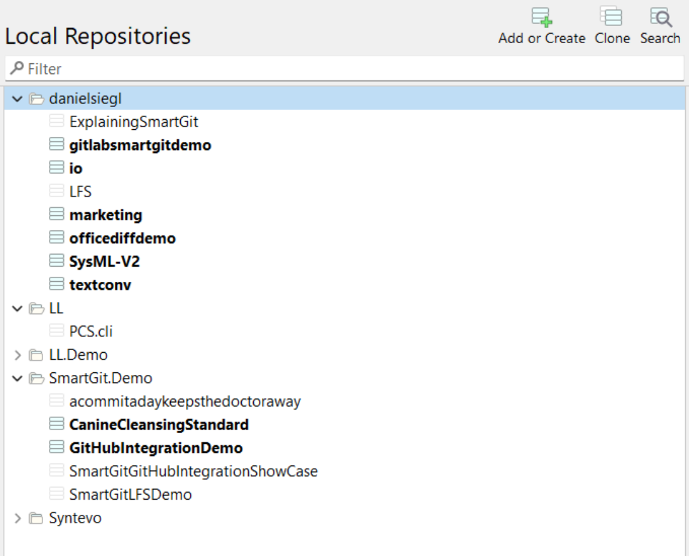

# 証言

私が最も共感したのは SmartGit です。私はすぐに驚き、非常に多くの機能ときちんとパッケージ化された SmartGit を使用することに感謝するようになりました。

# まとめ

ある開発者は、複数の Git GUI クライアントを評価した結果、SmartGit の包括的な機能セットとよく整理されたインターフェイスが競合他社よりも優れていることを発見しました。継続的な改善と優れたユーザー サポートにより、最終的には生涯ライセンスの購入による長期契約が実現しました。

# チャレンジ

- 複数のオプションの中から適切な Git GUI クライアントを見つける
- 基本的な Git 機能と高度な Git 機能の両方が必要
- 複数のリポジトリを効率的に管理する
- 複雑な Git 操作の処理
- 信頼性が高く応答性の高いユーザー サポートが必要

# 解決

- 直感的なリポジトリの検索と管理
- あらゆるスキルレベルに対応した包括的な機能セット
- よく整理されたユーザーインターフェイス
- 定期的な機能の更新と改善
- UserEcho と電子メールによるレスポンシブなサポート システム

# ギャラリー

# インパクト

- 初日からリポジトリ管理を簡素化
- 最初の学習曲線にも関わらず、すぐに適応できます
- Git ワークフローの効率の向上
- 継続的な製品改善へのアクセス
- 長期的なソフトウェア投資への自信

# 利点

- 効率的なリポジトリ検索機能
- 包括的な Git 操作機能
- 定期的な機能アップデート
- 優れたユーザーサポート
- よく整理されたインターフェース

# 特徴

- 高度なリポジトリ検索
- 定期的な増分更新
- 広範な Git 操作のサポート
- [UserEcho](https://smartgit.userecho.com/) でのユーザー主導開発
- 第 3 レベルの開発者を直接サポート

# 結論

当初は圧倒的なインターフェースにもかかわらず、SmartGit は機能と構成の完璧なバランスによってその価値を証明しました。堅牢な機能、定期的なアップデート、優れたユーザー サポートの組み合わせにより、このユーザーはソフトウェアを生涯にわたって使用することを確信しました。このエクスペリエンスは、Git GUI クライアント スペースでユーザーの期待を満たすだけでなく、それを超える SmartGit の能力を示しています。
