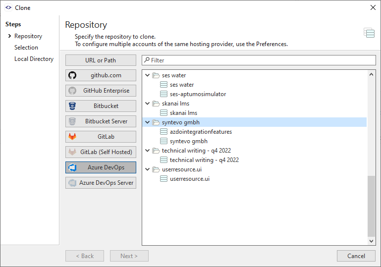
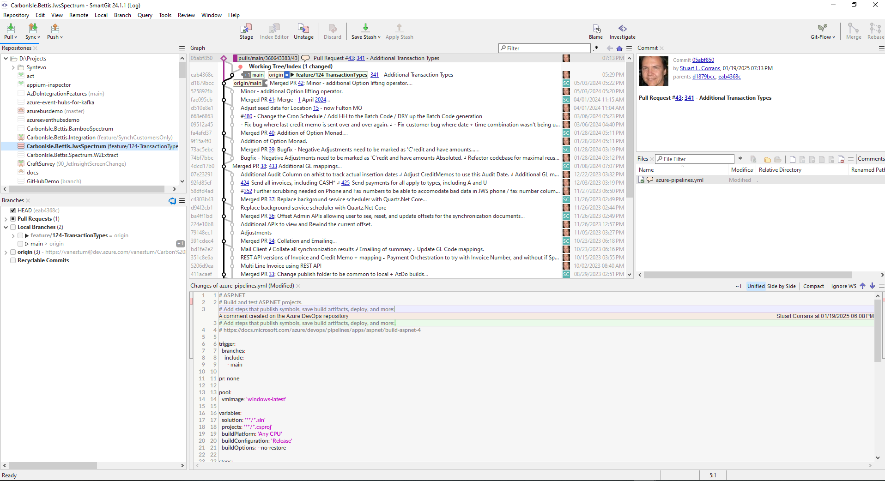

# 証言

私はプロのソフトウェア請負業者として、さまざまな Git ホスティング プロバイダーやさまざまなソフトウェア開発分岐とプロセスを使用するさまざまな顧客と並行してプロジェクトに取り組むことがよくあります。 SmartGit を使用すると、一貫したユーザー インターフェイスを使用してさまざまなテクノロジにまたがって作業できるようになり、リポジトリごとの機能フロー構成により、各顧客のブランチの命名規則を覚える時間を節約できます。

# まとめ

Vanestum Consulting にとって、異なる Git ホスティング プロバイダーと開発プロセスを使用して複数のクライアント プロジェクトを管理することは、大きな課題でした。 SmartGit は、ワークフローを簡素化し、プロジェクトの多様なニーズに適応する統合ソリューションを提供しました。

# チャレンジ

- さまざまな顧客プロジェクトにさまざまな Git ツールを使用します。
- 一般的な IDE に統合された Git ツールは機能が制限されています。
- 最後の手段として git コマンド ラインを使用します。
- デスクトップ IDE と Git ホスティング サイトを切り替えて、プル リクエストの管理、コード レビューの実行、問題追跡システムの更新を行います。

# 解決

SmartGit を人気の Git ホスティングおよび問題追跡サービスにシームレスに統合することで、開発者は次のことが可能になります。
- SmartGit 内で保留中のプル リクエストに関する通知を受け取ります。
- 一貫したデスクトップ ユーザー インターフェイスでファイルとコミットの違いを比較します。
- Git ホスティング プロバイダーの Web サイトに切り替えることなく、コメントを送信し、プル リクエストを承認または拒否できます。
- コミットを JIRA チケットにリンクし、Bugtraq 互換の問題追跡システムからコミット コメントを入力します。

# ギャラリー

# インパクト

- プル リクエストの完了と追跡システムの問題のクローズはすべて SmartGit 内から行われるため、デスクトップと Git ホスティング Web アプリを切り替える際の時間を節約できます。
- 使い慣れた SmartGit ユーザー インターフェイスにより、異なる言語のプロジェクトや Git ホスティング ベンダーを切り替えるときに、別のツールを学ぶ必要がなくなります。
- ツールを切り替えることなく、インタラクティブなリベース、コミットグラフの視覚化、豊富な差分比較ビューなどの高度な Git 機能を最大限に活用できます。

# 特徴

- GitHub、Azure DevOps、GitLab、Atlassian BitBucket などの Git ホスティング サービスとの緊密な統合。
- JIRA および Bugtraq との統合により、問題追跡システムが可能になりました。
- 比較ビューが強化され、プル リクエストに対する共同コメントが可能になります。

# 結論

ソフトウェア請負業者は、多くの場合、複数のテクノロジー、アプリケーション、Git ホスティング サービスを扱います。
IDE の Git ツールとリモート ホスト (GitHub、Azure DevOps、GitLab、BitBucket など) を切り替えると、集中力が失われ、間違いを犯す可能性が高くなります。
SmartGit は、一般的な「デスクトップ」ソフトウェア開発タスク アクティビティのライフサイクルを拡張し、コミットのプッシュ後のプル リクエストの発行、コード レビューの実行、SmartGit 内からのプル リクエストのマージを含むと同時に、コミットを JIRA チケットにリンクします。
SmartGit は、一般的なオンプレミスおよびクラウドでホストされる Git および問題追跡アプリケーションと統合することで、学習曲線とコンテキストの切り替えを軽減し、請負業者がツールの詳細ではなく顧客に集中できるようにします。

# ピッチ

開発者なら誰でも知っているように、ソフトウェア ツールの切り替えには学習に時間がかかり、生産性が低下し、間違いが発生する可能性が高くなります。
SmartGit は、快適なデスクトップから、複数の業界標準の Git ホスティングおよび問題追跡サービスにわたって一貫したユーザー インターフェイスを提供します。
開発者は、GitHub、Azure DevOps、または GitLab でブラウザ ウィンドウを開くことなく、プル リクエストのレビューとコメント、コミット履歴のマージ、スカッシュ、およびリベースを行うことができるようになりました。
