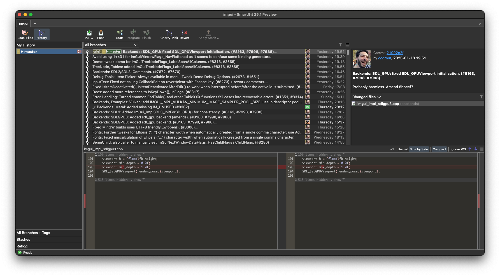
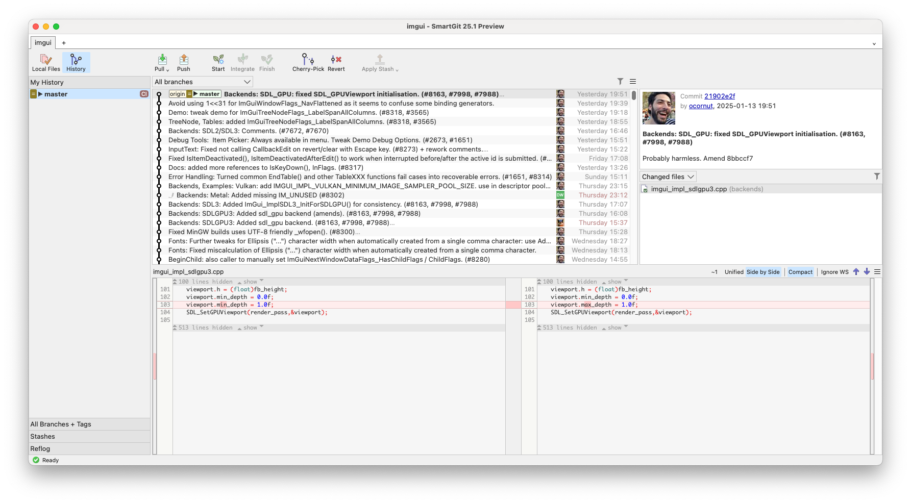
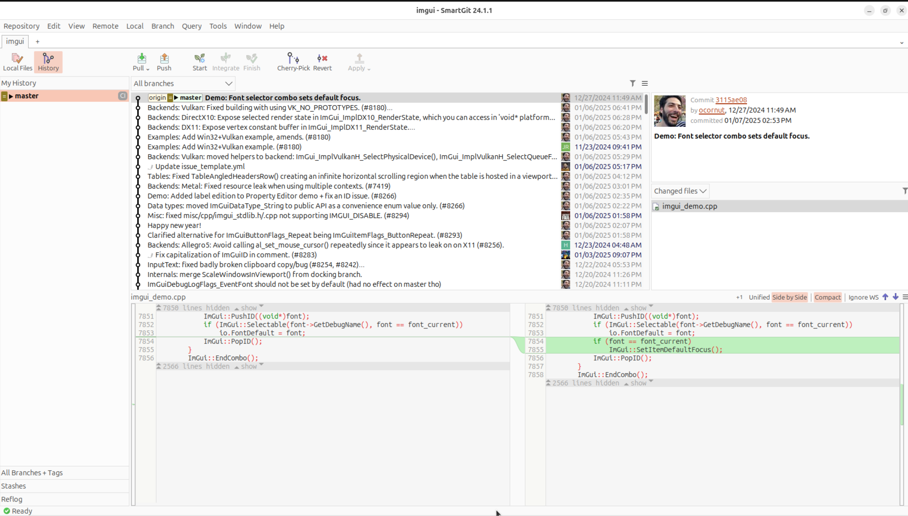

# testimonial

If it wasn't for the ease of use and cross-platform availability of SmartGit I don't think I would have made the transition from legacy SCM systems to Git.

# summary

An experienced Eclipse developer's decade-long journey with SmartGit showcases how the tool's intuitive interface and cross-platform capabilities made the transition from legacy source control systems to Git not just possible, but productive. Even for developers deeply embedded in the Eclipse ecosystem, SmartGit proved to be the superior choice for Git operations.

# challenge

- Transitioning from legacy SCM systems to Git
- Managing Git workflow for an open-source project
- Finding a reliable cross-platform Git client
- Needing a tool that outperforms native IDE Git integration
- Maintaining consistent workflow across different operating systems

# solution

- User-friendly interface for Git operations
- Cross-platform availability ensuring consistent experience
- Comprehensive Git workflow management
- Seamless integration with existing development processes
- Superior functionality compared to built-in IDE tools

# gallery

# impact

- Successfully migrated from legacy SCM to Git
- Maintained consistent development workflow since 2011
- Enabled effective management of open-source project
- Improved productivity compared to alternative Git tools
- Enhanced version control efficiency across platforms

# benefits

- Easy transition to Git for experienced developers
- Cross-platform compatibility
- Superior user experience
- Reliable long-term solution
- Better functionality than native IDE tools

# features

- Dedicated views for Working Tree and Log
- Cross-platform availability
- Advanced Git operation capabilities

# conclusion

SmartGit has proven its value over more than a decade of daily use in managing an open-source project. Its ability to provide a superior Git experience, even compared to native IDE tools, while maintaining cross-platform compatibility, makes it an invaluable tool for developers transitioning from legacy systems to modern version control. The longevity of use and preference over built-in alternatives demonstrates SmartGit's enduring value in professional development workflows.